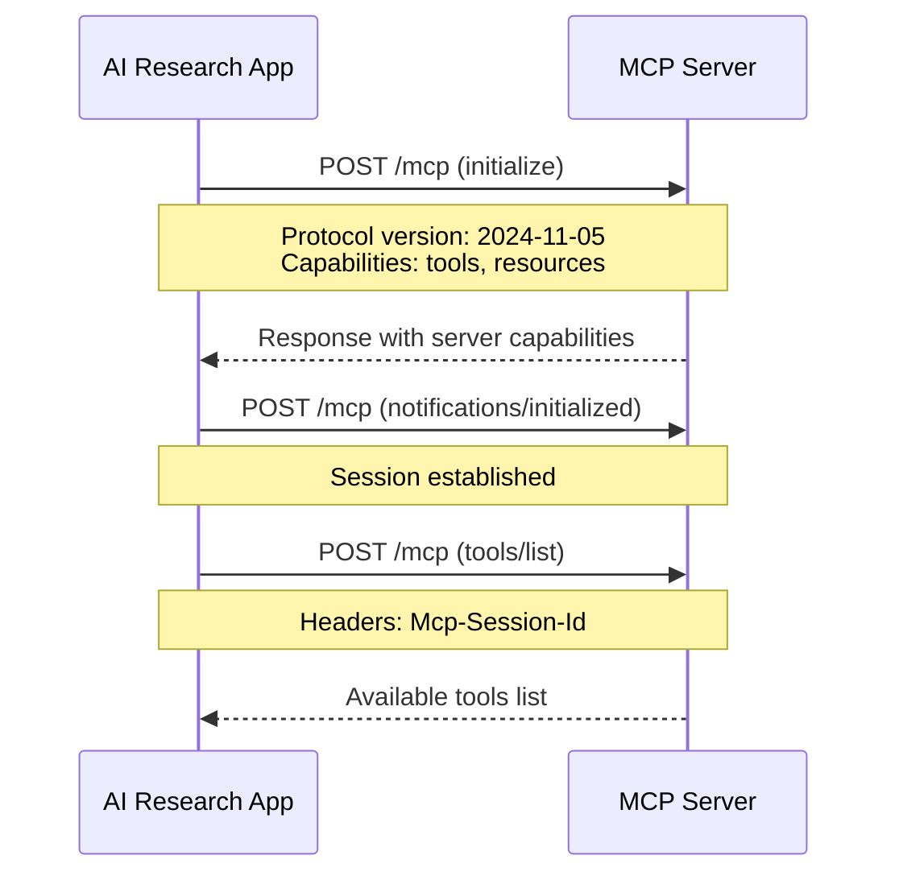

# AI Research Project (!!!UNDER DEVELOPMENT!!!)

A Spring Boot project for AI research.

## Table of Contents

- [About](#about)
- [Features](#features)
- [Model Context Protocol (MCP) Compliance](#model-context-protocol-mcp-compliance)
- [Getting Started](#getting-started)
  - [Prerequisites](#prerequisites)
  - [Installation](#installation)
  - [Configuration](#configuration)
- [Usage](#usage)
  - [Running the application](#running-the-application)
  - [API Endpoints](#api-endpoints)
- [Building](#building)
- [Testing](#testing)
- [Database](#database)
- [Security](#security)
- [Documentation](#documentation)
  - [Code Documentation](#code-documentation)
  - [MCP Compliance Documentation](#mcp-compliance-documentation)
  - [Multimodal Content Support](#multimodal-content-support)
  - [API Documentation](#api-documentation)
- [Contributing](#contributing)
- [License](#license)
- [Contact](#contact)

## About

This project, "AI Research Project," is a Spring Boot application designed for AI research purposes. It provides a backend system with capabilities for managing research tasks, interacting with AI models (e.g., OpenAI), and potentially integrating with other AI agents or services.

## Features

- Task management for AI research
- Interaction with Large Language Models (OpenAI and compatible APIs)
- Agent information display (Agent Card)
- **Multimodal content support** for processing images and PDFs with vision-enabled LLMs
- **Capability detection** for automatically identifying which models support which content types
- **100% MCP-compliant integration** with external Model Context Protocol servers
- **Robust chat functionality** with automatic message persistence and duplicate prevention
  - Full protocol handshake with initialization and capability negotiation
  - Session management with proper MCP-Session-Id header handling
  - JSON-RPC 2.0 compliant request/response structure
  - Support for MCP specification version 2024-11-05
  - **Tool execution workflow** - Complete tool calling from LLM through MCP servers
  - **Real-time tool feedback** - Stream progress and results of tool execution
  - **Enhanced error handling** - Provides clear error messages for empty responses after tool calls
  - **Non-persistent system prompts** - System messages are dynamically added by the AI service rather than stored in chat history
  - **Raw content storage** - Dual-storage system preserving both filtered content for display and unfiltered LLM output for transparency and debugging
- Peer-to-peer communication with other A2A (Agent-to-Agent) agents
- RESTful APIs for interaction
- Streaming capabilities for real-time data/task updates
- **Comprehensive API documentation** with detailed JavaDoc coverage

## Getting Started

### Prerequisites

- Java 21 (as specified in `pom.xml`)
- Maven (for building and dependency management)
- Access to an OpenAI compatible API endpoint or a running instance of a local LLM (if using the OpenAI integration).

### Installation

1.  **Clone the repository:**
    ```bash
    git clone https://github.com/SteffenHebestreit/spring_boot_ai_agent.git # Replace with your actual repository URL
    cd ai_research/backend
    ```

2.  **Build the project:**
    This command compiles the code, runs tests, and packages the application.
    ```bash
    mvn clean install
    ```

### Configuration

The primary configuration file is `src/main/resources/application.properties`. Environment variables can override these properties.

**Key properties to configure:**

-   **Application Name:**
    -   `spring.application.name` (Default: `ai_research`)

-   **Agent Card Details:**
    These properties define the identity and metadata of the AI agent.
    -   `agent.card.id` (Default: `ai-research-agent-2025`)
    -   `agent.card.name` (Default: `Research Assistant Agent`)
    -   `agent.card.description`
    -   `agent.card.url` (Default API base: `http://localhost:8080/research-agent/api`)
    -   `agent.card.provider.organization`
    -   `agent.card.provider.url`
    -   `agent.card.contact_email`

-   **Database (H2 File-based by default):**
    -   `spring.datasource.url` (Default: `jdbc:h2:./data/airesearch`)
    -   `spring.datasource.driverClassName` (Default: `org.h2.Driver`)
    -   `spring.datasource.username` (Default: `sa`)
    -   `spring.datasource.password` (Default: `password`)
    -   `spring.jpa.database-platform` (Default: `org.hibernate.dialect.H2Dialect`)
    -   `spring.jpa.hibernate.ddl-auto` (Default: `update`) - Manages schema updates.
    -   `spring.h2.console.enabled` (Default: `true`) - Enables H2 web console.
    -   `spring.h2.console.path` (Default: `/h2-console`) - Path to H2 console.
    *For production, it is strongly recommended to configure a more robust database system (e.g., PostgreSQL, MySQL) and update these properties accordingly.*

-   **OpenAI API Integration:**
    -   `openai.api.baseurl` (Default: `http://192.168.12.10:1234/v1`) - Base URL for the OpenAI compatible API.
    -   `openai.api.key`: **CRITICAL! This MUST be set as an environment variable `OPENAI_API_KEY` for security reasons. Do not hardcode it in `application.properties`.**
        Example (Linux/macOS): `export OPENAI_API_KEY="your_actual_api_key"`
        Example (Windows PowerShell): `$env:OPENAI_API_KEY="your_actual_api_key"`
    -   `openai.api.model` (Default: `gpt-4o`) - The default model ID to use for requests if not otherwise specified. This ID should correspond to one of the models defined in `llm.configurations`.

-   **LLM Configurations:**
    Defines the available LLMs and their capabilities. This allows the application to understand which models support multimodal inputs and enables the frontend to provide appropriate warnings. **All LLM configurations can be dynamically overridden using environment variables.**
    
    **Configuration Pattern:**
    For each LLM configuration index (0, 1, 2, etc.), the following environment variables can be set:
    -   `LLM_CONFIG_X_ID` - Unique identifier for the LLM (e.g., `gemma-7b`)
    -   `LLM_CONFIG_X_NAME` - User-friendly display name (e.g., `Google Gemma 7B`)
    -   `LLM_CONFIG_X_SUPPORTS_TEXT` - Boolean indicating text input support (default: `true`)
    -   `LLM_CONFIG_X_SUPPORTS_IMAGE` - Boolean indicating image input support (default: `false`)
    -   `LLM_CONFIG_X_SUPPORTS_PDF` - Boolean indicating PDF input support (default: `false`)
    -   `LLM_CONFIG_X_NOTES` - Additional notes about capabilities or limitations
    
    Where `X` is the configuration index (0, 1, 2, etc.).

    **Example Environment Variables:**
    ```bash
    # Configuration for LLM at index 0
    export LLM_CONFIG_0_ID="llama-3-8b"
    export LLM_CONFIG_0_NAME="Meta Llama 3 8B"
    export LLM_CONFIG_0_SUPPORTS_TEXT="true"
    export LLM_CONFIG_0_SUPPORTS_IMAGE="false"
    export LLM_CONFIG_0_SUPPORTS_PDF="false"
    export LLM_CONFIG_0_NOTES="Fast text-only model for general tasks"

    # Configuration for LLM at index 1
    export LLM_CONFIG_1_ID="claude-3-5-sonnet"
    export LLM_CONFIG_1_NAME="Anthropic Claude 3.5 Sonnet"
    export LLM_CONFIG_1_SUPPORTS_TEXT="true"
    export LLM_CONFIG_1_SUPPORTS_IMAGE="true"
    export LLM_CONFIG_1_SUPPORTS_PDF="false"
    export LLM_CONFIG_1_NOTES="Vision-enabled model with excellent reasoning"
    ```

    **Default Configuration (fallback values in application.properties):**
    The application includes sensible defaults that are used when environment variables are not set:
    -   Index 0: Google Gemma 7B (text-only)
    -   Index 1: Anthropic Claude 3 Opus (text + image)
    -   Index 2: OpenAI GPT-4o (text + image + PDF)

    *Example `application.properties` entries (with environment variable support):*
    ```properties
    llm.configurations[0].id=${LLM_CONFIG_0_ID:gemma-7b}
    llm.configurations[0].name=${LLM_CONFIG_0_NAME:Google Gemma 7B}
    llm.configurations[0].supportsText=${LLM_CONFIG_0_SUPPORTS_TEXT:true}
    llm.configurations[0].supportsImage=${LLM_CONFIG_0_SUPPORTS_IMAGE:false}
    llm.configurations[0].supportsPdf=${LLM_CONFIG_0_SUPPORTS_PDF:false}
    llm.configurations[0].notes=${LLM_CONFIG_0_NOTES:Text-only model, no multimodal capabilities}

    llm.configurations[1].id=${LLM_CONFIG_1_ID:claude-3-opus}
    llm.configurations[1].name=${LLM_CONFIG_1_NAME:Anthropic Claude 3 Opus}
    llm.configurations[1].supportsText=${LLM_CONFIG_1_SUPPORTS_TEXT:true}
    llm.configurations[1].supportsImage=${LLM_CONFIG_1_SUPPORTS_IMAGE:true}
    llm.configurations[1].supportsPdf=${LLM_CONFIG_1_SUPPORTS_PDF:false}
    llm.configurations[1].notes=${LLM_CONFIG_1_NOTES:Supports image analysis up to 10MB per image}

    llm.configurations[2].id=${LLM_CONFIG_2_ID:gpt-4o}
    llm.configurations[2].name=${LLM_CONFIG_2_NAME:OpenAI GPT-4o}
    llm.configurations[2].supportsText=${LLM_CONFIG_2_SUPPORTS_TEXT:true}
    llm.configurations[2].supportsImage=${LLM_CONFIG_2_SUPPORTS_IMAGE:true}
    llm.configurations[2].supportsPdf=${LLM_CONFIG_2_SUPPORTS_PDF:true}
    llm.configurations[2].notes=${LLM_CONFIG_2_NOTES:Supports image analysis and PDF processing via backend extraction}

    # The default model to be used by the application
    openai.api.model=${OPENAI_API_MODEL:gpt-4o}
    ```

-   **External MCP Server Integrations:**
    Configure if the agent needs to interact with external MCP servers.
    -   `agent.integrations.mcp-servers[0].name`
    -   `agent.integrations.mcp-servers[0].url`
    -   (Add more servers by incrementing the index)

-   **External A2A Peer Integrations:**
    Configure if the agent needs to communicate with other peer agents.
    -   `agent.integrations.a2a-peers[0].name`
    -   `agent.integrations.a2a-peers[0].url`
    -   (Add more peers by incrementing the index)

**Environment Variable Override:**
Any property in `application.properties` can be overridden by setting an environment variable with a corresponding name. For example, `SPRING_DATASOURCE_URL` overrides `spring.datasource.url`.

## Model Context Protocol (MCP) Compliance

This application provides **100% compliant integration** with Model Context Protocol (MCP) servers, following the MCP specification version **2024-11-05**. The implementation ensures proper protocol handshake, session management, and tool discovery.

### MCP Features

- ✅ **Full Protocol Handshake**: Proper `initialize` → `notifications/initialized` sequence
- ✅ **Session Management**: Automatic session ID generation and header management
- ✅ **Capability Negotiation**: Announces support for tools and resources with change notifications
- ✅ **JSON-RPC 2.0 Compliance**: Correct request/response structure with required `params` field
- ✅ **Modern Method Support**: Uses current MCP methods (`tools/list`, `tools/call`)
- ✅ **Authentication Support**: Bearer tokens and Keycloak client credentials
- ✅ **Error Resilience**: Graceful handling of connection failures and protocol errors

### MCP Integration Flow



### Configuration Example

```yaml
agent:
  integrations:
    mcp-servers:
      - name: "webcrawl-mcp"
        url: "https://mcp-server.example.com"
        auth:
          type: "bearer"
          token: "${MCP_SERVER_TOKEN}"
      - name: "data-analysis-mcp"
        url: "https://analysis.example.com"
        auth:
          type: "keycloak_client_credentials"
          authServerUrl: "https://auth.example.com"
          realm: "mcp-realm"
          clientId: "analysis-client"
          clientSecret: "${KEYCLOAK_SECRET}"
```

### Supported Authentication Methods

| Method | Configuration | Description |
|--------|---------------|-------------|
| `none` | No auth config | Public MCP servers |
| `bearer` | `token: "your-token"` | Static Bearer token |
| `keycloak_client_credentials` | Full Keycloak config | OAuth2 client credentials with token caching |

### MCP Compliance Verification

The implementation has been verified against the reference MCP server [SteffenHebestreit/webcrawl-mcp](https://github.com/SteffenHebestreit/webcrawl-mcp) and follows all protocol requirements:

- **Initialization Sequence**: Required before any tool operations
- **Session Headers**: `Mcp-Session-Id` included in all post-initialization requests  
- **JSON-RPC Structure**: Proper `jsonrpc`, `method`, `id`, and `params` fields
- **Error Handling**: Standard JSON-RPC 2.0 error codes and responses

## Usage

### Running the application

There are multiple ways to run the Spring Boot application:

1.  **Using Maven Spring Boot plugin (for development):**
    ```bash
    mvn spring-boot:run
    ```

2.  **Running the packaged JAR (after `mvn clean package`):**
    ```bash
    java -jar target/ai_research-0.0.1-SNAPSHOT.jar
    ```
    You can also pass Spring Boot properties via command line:
    ```bash
    java -jar target/ai_research-0.0.1-SNAPSHOT.jar --server.port=8081 --OPENAI_API_KEY="your_key"
    ```

The application will typically start on `http://localhost:8080` unless the `server.port` property is changed.

### API Endpoints

The application exposes RESTful APIs for various functionalities.

#### Enhanced `Message` Object for Multimodal Support

To support inputs like images or PDF documents alongside text, the `Message` object used in various API endpoints (e.g., for creating chats, adding messages, creating tasks) can be structured to handle multimodal content.

The `content` field of a `Message` object can either be:
1.  A plain string (for text-only messages, ensuring backward compatibility).
    ```json
    {
      "role": "user",
      "contentType": "text/plain",
      "content": "Hello AI"
    }
    ```
2.  An array of content blocks, where each block specifies its `type` and corresponding data. This is the recommended approach for multimodal messages. When using an array for `content`, the top-level `contentType` field in the `Message` object might be set to a general type like `multipart/mixed`, as individual parts within the `content` array specify their own types.
    ```json
    {
      "role": "user",
      "contentType": "multipart/mixed",
      "content": [
        {
          "type": "text",
          "text": "Describe this image and summarize the attached PDF."
        },
        {
          "type": "image_url",
          "image_url": {
            "url": "data:image/jpeg;base64,..."
          }
        },
        {
          "type": "image_url",
          "image_url": {
            "url": "data:application/pdf;base64,..."
          }
        }
      ]
    }
    ```
    Supported `type` values within the `content` array would typically include `text` and `image_url`. The `image_url` type can be used for actual image URLs or for data URIs (which allows embedding base64 encoded image or PDF data directly). The backend service is responsible for processing these parts and forwarding them to the vision-enabled LLM in the appropriate format.

#### Agent Card Controller (`AgentCardController.java`)

Base Path: (No specific base path, uses root)

*   **`GET /.well-known/agent.json`**
    *   Description: Serves the agent card JSON, providing metadata about the AI agent. This endpoint is specified by the Agent-to-Agent (A2A) protocol.
    *   Response: `AgentCard` JSON object.

#### Chat Controller (`ChatController.java`)

Base Path: `/research-agent/api/chats`

*   **`GET /`**
    *   Description: Get all chats.
    *   Response: JSON object containing a "result" key with a list of `Chat` objects.
*   **`GET /{chatId}`**
    *   Description: Get a specific chat by its ID.
    *   Parameters: `chatId` (Path Variable) - The ID of the chat to retrieve.
    *   Response: JSON object containing a "result" key with the `Chat` object, or a 404 error if not found.
*   **`POST /create`**
    *   Description: Create a new chat with an initial message.
    *   Request Body: `Message` JSON object (e.g., `{"role": "user", "contentType": "text/plain", "content": "Hello AI"}`)
    *   Response: JSON object containing a "result" key with the created `Chat` object (which includes the initial message).
*   **`POST /{chatId}/messages`**
    *   Description: Add a message to an existing chat. This is typically used by the frontend to save user messages and completed AI responses.
    *   Parameters: `chatId` (Path Variable) - The ID of the chat.
    *   Request Body: `Message` JSON object.
    *   Response: JSON object containing a "result" key with the updated `Chat` object.
*   **`POST /{chatId}/message/stream`**
    *   Description: Stream an AI-generated response to a new user message in a specific chat.
    *   Parameters: `chatId` (Path Variable) - The ID of the chat.
    *   Request Body: `String` (Plain text content of the user's message).
    *   Consumes: `text/plain`
    *   Produces: `application/ndjson` (Newline Delimited JSON, streaming chunks of the AI's response or an error JSON).
*   **`PUT /{chatId}/title`**
    *   Description: Update the title of a chat.
    *   Parameters: `chatId` (Path Variable) - The ID of the chat.
    *   Request Body: JSON object (e.g., `{"title": "New Chat Title"}`)
    *   Response: JSON object containing a "result" key with the updated `Chat` object.
*   **`DELETE /{chatId}`**
    *   Description: Delete a chat by its ID.
    *   Parameters: `chatId` (Path Variable) - The ID of the chat.
    *   Response: JSON object confirming success or an error.
*   **`GET /{chatId}/messages`**
    *   Description: Get all messages for a specific chat and marks the chat as read.
    *   Parameters: `chatId` (Path Variable) - The ID of the chat.
    *   Response: JSON object containing a "result" key with a list of `ChatMessage` objects.
*   **`GET /{chatId}/messages/{messageId}/raw`**
    *   Description: Retrieve the raw, unfiltered content of a specific message. Returns both the filtered content (displayed in chat) and the raw LLM output including think tags and internal reasoning.
    *   Parameters: 
        * `chatId` (Path Variable) - The ID of the chat
        * `messageId` (Path Variable) - The ID of the specific message
    *   Response: JSON object containing:
        * `messageId` - The message identifier
        * `rawContent` - The original unfiltered LLM output (may include think tags)
        * `filteredContent` - The content displayed in the chat interface
        * `hasRawContent` - Boolean indicating if raw content is available
*   **`GET /admin/test`**
    *   Description: Test endpoint restricted to users with the 'ADMIN' role.
    *   Requires: Authentication and 'ADMIN' role.
*   **`GET /user/test`**
    *   Description: Test endpoint restricted to users with the 'USER' role.
    *   Requires: Authentication and 'USER' role.

#### Task Controller (`TaskController.java`)

Base Path: `/research-agent/api`

*   **`POST /chat`**
    *   Description: Processes a single user message and returns a complete AI response (non-streaming). Creates a new chat, adds user message, gets AI response, adds AI response to chat.
    *   Request Body: `String` (Plain text content of the user's message).
    *   Consumes: `text/plain`
    *   Produces: `text/plain` (The AI's response).
*   **`POST /chat-multimodal`**
    *   Description: Processes a user message that can include text and/or a file (image, PDF) and returns a complete AI response (non-streaming). Creates a new chat, adds user message (including file reference/data), gets AI response, adds AI response to chat.
    *   Request Body: `multipart/form-data`. Should contain a `file` part for the image/PDF and optional `prompt` and `llmId` parts.
    *   Parameters:
        * `file` (Required): The image or PDF file to analyze.
        * `prompt` (Optional): Textual message to accompany the file.
        * `llmId` (Optional): ID of the specific LLM to use. If not provided, the default model from configuration is used.
    *   Produces: `text/plain` (The AI's response) or `application/json` (if an error occurs).
*   **`POST /chat-stream`**
    *   Description: Processes a single user message and streams the AI response. Creates a new chat, adds user message, streams AI response, and saves the complete AI response to chat history upon completion.
    *   Request Body: `String` (Plain text content of the user's message).
    *   Consumes: `text/plain`
    *   Produces: `application/ndjson` (Streaming chunks of the AI's response or an error message).
*   **`POST /chat-stream-multimodal`**
    *   Description: Processes a user message that can include text and/or a file (image, PDF) and streams the AI response. Creates a new chat, adds user message (including file reference/data), streams AI response, and saves the complete AI response to chat history upon completion.
    *   Request Body: `multipart/form-data`. Should contain a `file` part for the image/PDF and optional `prompt` and `llmId` parts.
    *   Parameters: Same as `/chat-multimodal`
    *   Produces: `application/ndjson` (Streaming chunks of the AI's response or an error message).
*   **`POST /tasks/create`**
    *   Description: Creates a new research task with an initial message.
    *   Request Body: `Message` JSON object (e.g., `{"role": "user", "contentType": "text/plain", "content": "Start a new research task about X"}`)
    *   Response: JSON object containing a "result" key with the created `Task` object.
*   **`GET /tasks/{taskId}/get`**
    *   Description: Retrieves details of a specific task by its ID.
    *   Parameters: `taskId` (Path Variable) - The ID of the task.
    *   Response: JSON object containing a "result" key with the `Task` object, or a 404 error if not found.
*   **`POST /message/send`**
    *   Description: Adds a message to an existing task.
    *   Request Body: JSON object (e.g., `{"taskId": "task-123", "message": {"role": "user", "contentType": "text/plain", "content": "Additional instruction."}}`)
    *   Response: JSON object containing a "result" key with the updated `Task` object, or a 404 error if the task is not found.
*   **`POST /tasks/{taskId}/cancel`**
    *   Description: Cancels an existing task.
    *   Parameters: `taskId` (Path Variable) - The ID of the task.
    *   Response: JSON object containing a "result" key with the updated `Task` object (reflecting cancellation status), or a 404 error if not found.

#### Task Streaming Controller (`TaskStreamingController.java`)

Base Path: `/api` (Note: This controller uses a different base path `/api` compared to others which use `/research-agent/api`)

*   **`POST /tasks/resubscribe`**
    *   Description: Allows a client to resubscribe to Server-Sent Events (SSE) for a specific task, typically after a disconnect. Immediately sends the current task state.
    *   Request Body: JSON object (e.g., `{"taskId": "task-123", "id": "json-rpc-request-id"}`)
    *   Produces: `text/event-stream` (SSE for task updates).
*   **`POST /message/stream`**
    *   Description: Processes a message for a task and establishes an SSE stream for updates related to that task. This is used for ongoing interactions where the client expects multiple updates.
    *   Request Body: JSON-RPC 2.0 like structure (e.g., `{"jsonrpc": "2.0", "id": "req-1", "method": "message_stream", "params": {"taskId": "task-xyz", "message": {"role": "user", "content": "Analyze this data."}}}`)
        *   The `params` object should contain `taskId` and a `message` object.
    *   Produces: `text/event-stream` (SSE for task updates, including status and artifacts, formatted as JSON-RPC 2.0 responses).

#### LLM Controller (`LlmController.java`)

Base Path: `/research-agent/api/llms`

*   **`GET /capabilities`**
    *   Description: Retrieves a list of configured LLMs and their capabilities (e.g., support for text, image, PDF). This allows the frontend to dynamically adapt its UI, such as enabling/disabling file upload options or showing warnings if a selected LLM does not support a certain data type.
    *   Response: JSON array of LLM capability objects.
        *Example Response Body:*
        ```json
        [
          {
            "id": "gemma-7b",
            "name": "Google Gemma 7B",
            "capabilities": {
              "text": true,
              "image": false,
              "pdf": false
            },
            "notes": "Text-only model, no multimodal capabilities"
          },
          {
            "id": "gpt-4o",
            "name": "OpenAI GPT-4o",
            "capabilities": {
              "text": true,
              "image": true,
              "pdf": true
            },
            "notes": "Supports image analysis and PDF processing via backend extraction"
          }
        ]
        ```
*   **`GET /default`**
    *   Description: Retrieves the default LLM configuration as specified by openai.api.model property.
    *   Response: The default LLM configuration object or an error message if no default is configured.
*   **`GET /{llmId}/supports/{dataType}`**
    *   Description: Checks if a specific LLM supports a given data type. This is useful for frontends to verify support before attempting to upload data.
    *   Parameters:
        * `llmId` (Path Variable) - The ID of the LLM to check
        * `dataType` (Path Variable) - The data type to check (text, image, pdf)
    *   Response: JSON object with a support flag and additional info.
        ```json
        {
          "llmId": "gpt-4o",
          "dataType": "image",
          "supported": true,
          "llmName": "OpenAI GPT-4o",
          "notes": "Supports image analysis and PDF processing via backend extraction"
        }
        ```

*(Detailed request/response formats, parameters, and authentication requirements for each endpoint should be documented here based on the actual implementation in `*Controller.java` files.)*

## Building

To build the project and create an executable JAR file:

```bash
mvn clean package
```

The resulting JAR file (e.g., `ai_research-0.0.1-SNAPSHOT.jar`) will be located in the `target/` directory. This JAR includes all necessary dependencies and can be run directly.

## Testing

The project includes unit and integration tests.

To run all tests:
```bash
mvn test
```

Test reports are typically generated in the `target/surefire-reports/` directory.
The tests utilize a specific Spring profile named "test" (activated via `@ActiveProfiles("test")` in test classes). This profile uses an H2 in-memory database and other test-specific configurations defined in `src/test/resources/application-test.properties`.

## Database

-   **Development & Default:** The application is configured to use an H2 file-based database by default. Data is stored in the `./data/` directory relative to where the application is run (e.g., `backend/data/airesearch.mv.db`).
    -   The H2 console can be accessed at `http://localhost:8080/h2-console` (if `spring.h2.console.enabled=true`). Use the JDBC URL `jdbc:h2:./data/airesearch`, username `sa`, and password `password` to connect.
-   **Testing:** For automated tests, an H2 in-memory database is used, ensuring tests are isolated and do not persist data between runs.
-   **Production:** For a production environment, it is crucial to switch to a more robust and scalable database system such as PostgreSQL, MySQL, Oracle, or SQL Server. This involves:
    1.  Adding the appropriate JDBC driver dependency to `pom.xml`.
    2.  Updating the `spring.datasource.*` properties in `application.properties` (or via environment variables) to point to the production database instance.
    3.  Ensuring the `spring.jpa.hibernate.ddl-auto` property is set appropriately for production (e.g., `validate` or `none`, with schema managed by migration tools like Flyway or Liquibase).

## Security

The security configuration is defined in `src/main/java/com/steffenhebestreit/ai_research/Configuration/SecurityConfig.java`.

-   **Current Configuration:**
    -   CSRF (Cross-Site Request Forgery) protection is **disabled**.
    -   All HTTP requests (`.anyRequest().permitAll()`) are permitted without authentication by default within this application's security filter chain.
    -   CORS (Cross-Origin Resource Sharing) is enabled and configured to allow requests from `http://localhost:3000` by default, with common HTTP methods and headers permitted. Credentials (cookies, authorization headers) are allowed.

-   **Production Considerations:**
    -   The comments in `SecurityConfig.java` suggest that authentication is intended to be handled by an external system like Keycloak in a production environment.
    -   If Keycloak or a similar external authentication provider is used, ensure the integration is correctly configured and that the Spring Boot application properly validates tokens or assertions from the provider.
    -   If the application is to handle its own authentication or requires more granular authorization, the `SecurityConfig` will need significant enhancements (e.g., configuring authentication providers, defining access rules per endpoint, enabling CSRF with proper token handling).
    -   **HTTPS should be enforced in production** to protect data in transit. This is typically handled at a reverse proxy/load balancer level or can be configured within Spring Boot.
    -   **Sensitive Information:** As highlighted in the Configuration section, API keys (like `OPENAI_API_KEY`) and other secrets (database passwords, etc.) **MUST NOT** be hardcoded in `application.properties` or committed to version control. Use environment variables, Spring Cloud Config, HashiCorp Vault, or other secure secret management solutions.

## Documentation

The AI Research application includes comprehensive documentation at multiple levels, ensuring developers can quickly understand and effectively use the system.

### Code Documentation

**Complete JavaDoc Coverage:**
The entire codebase features enterprise-level JavaDoc documentation with:

- **Class-level documentation**: Comprehensive overviews explaining purpose, architecture, and integration patterns
- **Method documentation**: Detailed parameter descriptions, return values, usage examples, and error handling
- **Field documentation**: Clear explanations of data structures and usage patterns
- **Cross-references**: Extensive linking between related classes and methods

**Documentation Highlights:**

**Configuration Layer:**
- `LlmConfigProperties` - Multi-LLM configuration management and capability matching
- `AgentCardProperties` - A2A protocol compliance and runtime configuration override
- `AuthConfig` - Comprehensive authentication configuration for external integrations
- `SecurityConfig` - Security policies, CORS configuration, and production considerations
- `OpenAIProperties` - OpenAI-compatible API configuration and model selection

**Model Layer:**
- `AgentCapabilities` - A2A protocol capability flags and feature declaration
- `AgentSkill` - Detailed skill specification for multi-agent task routing
- `AgentProvider` - Provider attribution and trust establishment
- `Chat` & `ChatMessage` - Persistent conversation management with lifecycle tracking
- `Message` - Multimodal content support with polymorphic content handling
- `TaskArtifact` - AI-generated deliverable management and content classification

**Service Layer:**
- `LlmCapabilityService` - Dynamic model capability detection and validation
- `OpenAIService` - OpenAI-compatible API integration with multimodal support
- `MultimodalContentService` - File processing, validation, and content transformation
- `ChatService` - Conversation lifecycle management and message processing
- `TaskUpdateListener` - Real-time update broadcasting and event management
- `DynamicIntegrationService` - **100% MCP-compliant** external system integration

**Controller Layer:**
- `MultimodalController` - Multimodal content processing endpoints
- `LlmController` - Model capability discovery and configuration access
- `AgentCardController` - A2A protocol compliance and agent discovery
- `ChatController` - Conversation management API
- `TaskController` - Research task management and processing

**Repository Layer:**
- `ChatRepository` & `ChatMessageRepository` - Data access patterns with performance optimization

### MCP Compliance Documentation

**Complete Model Context Protocol Implementation:**

The application features **100% compliant** integration with Model Context Protocol (MCP) servers following specification version **2024-11-05**. This implementation enables seamless tool discovery and execution from external MCP-compatible services.

**Key MCP Features:**
- **Full Protocol Handshake**: Required initialization sequence with capability negotiation
- **Session Management**: Automatic session ID generation and header management  
- **JSON-RPC 2.0 Compliance**: Proper request/response structure with all required fields
- **Authentication Support**: Bearer tokens and Keycloak OAuth2 client credentials
- **Modern Method Names**: Uses current MCP methods (tools/list, not legacy mcp.* methods)
- **Error Resilience**: Graceful degradation with comprehensive error handling

**Implementation Details:**
- **DynamicIntegrationService**: Core MCP integration service with full protocol compliance
- **TokenWrapper**: Intelligent authentication token caching with automatic expiry
- **Session Lifecycle**: Complete initialize → notifications/initialized → tool discovery flow
- **Reference Compliance**: Verified against SteffenHebestreit/webcrawl-mcp reference implementation

**Documentation Location:**
- `docs/mcp-compliance.md` - Complete MCP implementation documentation
- `docs/mcp-quick-reference.md` - Developer quick start guide  
- Inline JavaDoc - Detailed method and class documentation with protocol specifications

### Multimodal Content Support

The application supports processing multimodal content (text + images/PDFs) with vision-enabled LLMs. This functionality is implemented through:

- **Enhanced Message Structure**: Polymorphic content handling supporting text, images, and PDFs
- **LLM Capability Detection**: Dynamic model capability discovery and validation
- **File Processing Services**: Comprehensive file validation, transformation, and data URI conversion
- **Streaming Support**: Real-time multimodal content processing with progress updates
- **API Endpoints**: Dedicated endpoints for multimodal interactions
- **Dynamic LLM Selection**: Ability to specify which LLM to use for each streaming request

**Key Features:**
- Automatic capability matching between content types and available models
- Base64 data URI conversion for seamless API integration
- File size and format validation with detailed error reporting
- Support for both synchronous and streaming multimodal processing
- Model-specific request routing through query parameters

For detailed technical information, see the [Multimodal Content Support](docs/multimodal-content-support.md), [Chat Controller Updates](docs/chat-controller-updates.md), and [Chat Message Flow Fix](docs/chat-message-flow-fix.md) documentation.

### Chat Message Flow Fix

The application includes a robust solution for chat message persistence issues:

- **Auto-saving User Messages**: Backend automatically saves user messages sent to streaming endpoint
- **Enhanced Duplicate Detection**: Prevents duplicate messages using both exact and substring matching
- **Flexible API Usage**: Supports multiple frontend integration patterns for maximum compatibility
- **Transaction Management**: Reliable message persistence with explicit transaction boundaries
- **Comprehensive Testing**: Thorough test coverage of all message flow scenarios

**Key Features:**
- Backend resilience to frontend API call sequence variations
- Intelligent duplicate detection for AI responses to prevent duplication
- Detailed logging and error handling for troubleshooting
- Compatible with existing frontend implementations
- Complete conversation preservation regardless of API usage pattern

For detailed technical information, see:
- [Chat Message Flow Fix](docs/chat-message-flow-fix.md) - Overview of the fix
- [Technical Chat Message Flow Fix](docs/technical-chat-message-flow-fix.md) - Detailed implementation
- [Chat Message Flow Testing Guide](docs/chat-message-flow-testing-guide.md) - Verification steps
- [Chat Message Flow Changes Summary](docs/chat-message-flow-changes-summary.md) - Complete change list

### API Documentation

**Comprehensive Endpoint Documentation:**
Each API endpoint includes:
- **Request/Response Examples**: Complete JSON examples with multimodal content structures
- **Parameter Specifications**: Detailed type information, constraints, and validation rules
- **Error Handling**: Common error scenarios with response formats
- **Usage Patterns**: Best practices and integration guidelines

This documentation approach ensures developers can quickly understand the system architecture, effectively use the APIs, and maintain high code quality during development and evolution.

### Raw Content Storage

The application implements a dual-storage system for AI responses that preserves both filtered content for display and unfiltered LLM output for transparency and debugging purposes.

**Key Features:**
- **Dual Storage System**: Stores both filtered content (for display) and raw content (including think tags)
- **Security Validation**: Ensures only filtered content is sent to LLM providers, preventing think tags from being transmitted externally
- **Transparency**: Preserves complete LLM outputs including internal reasoning and tool execution details
- **Debugging Support**: Enables analysis of full LLM responses for troubleshooting and optimization
- **API Access**: Dedicated endpoint for retrieving raw content when needed

**Implementation Details:**

**Database Schema:**
- Added `raw_content` field to `ChatMessage` entity with 30,000 character limit
- Automatic raw content storage when filtering occurs during message creation

**API Integration:**
- `POST /chats/create` - Automatically saves raw content when think tags are filtered
- `POST /chats/{chatId}/messages` - Saves raw content for manually added messages  
- `POST /chats/{chatId}/message/stream` - Preserves raw streaming responses
- `GET /chats/{chatId}/messages/{messageId}/raw` - Retrieves raw content for debugging

**Content Filtering Flow:**
1. Original LLM output contains think tags and internal reasoning
2. Content is filtered using `ContentFilterUtil.filterForDatabase()` for display
3. If filtering occurs, both versions are stored:
   - `content` field: Filtered version for chat display
   - `rawContent` field: Original unfiltered output
4. Only filtered content is used when communicating with LLM providers

**Security Considerations:**
- **External Communication**: The `prepareMessagesForLlm()` method uses `msg.getContent()` (filtered content) when sending messages to LLM providers
- **Think Tag Protection**: Think tags and raw content are never transmitted to external LLM services
- **Internal Use Only**: Raw content is accessible only through dedicated API endpoints for debugging

**Use Cases:**
- **Debugging**: Analyze complete LLM responses to troubleshoot unexpected behavior
- **Transparency**: Understand the full reasoning process behind AI responses
- **Development**: Monitor and improve system prompts based on internal reasoning
- **Quality Assurance**: Verify that think tags and internal content are properly filtered

**Example Raw Content Response:**
```json
{
  "result": {
    "messageId": "msg-123",
    "rawContent": "<think>I need to analyze this request carefully...</think>Here is my response to your question.",
    "filteredContent": "Here is my response to your question.",
    "hasRawContent": true
  }
}
```

This feature ensures complete transparency in AI interactions while maintaining security and proper content filtering for both display and external API communications.

## Contributing

## License

## Contact

