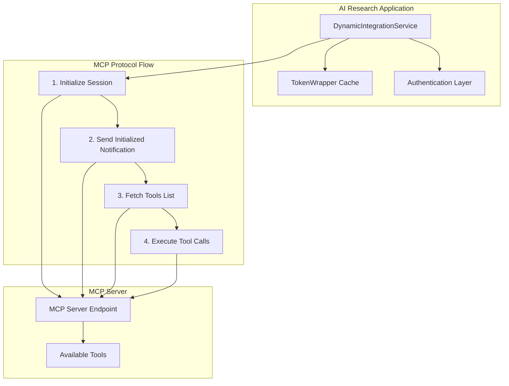

# Model Context Protocol (MCP) Compliance Documentation

## Overview

This document details the **100% compliant** Model Context Protocol (MCP) implementation in the AI Research application's `DynamicIntegrationService`. The implementation follows MCP specification **version 2024-11-05** and has been verified against reference implementations.

## Implementation Status ✅

| **MCP Requirement** | **Status** | **Implementation Details** |
|---------------------|------------|---------------------------|
| Protocol Initialization | ✅ Complete | Full `initialize` → `notifications/initialized` handshake |
| Session Management | ✅ Complete | Automatic session ID generation and tracking |
| JSON-RPC 2.0 Structure | ✅ Complete | Proper `jsonrpc`, `method`, `id`, `params` fields |
| Capability Negotiation | ✅ Complete | Tools and resources capabilities with change notifications |
| Modern Method Names | ✅ Complete | Uses `tools/list`, `tools/call` (not legacy methods) |
| Authentication Support | ✅ Complete | Bearer tokens and Keycloak OAuth2 support |
| Error Handling | ✅ Complete | JSON-RPC 2.0 error codes and graceful degradation |
| Session Headers | ✅ Complete | `Mcp-Session-Id` header management |

## Architecture Overview



## Protocol Implementation Details

### 1. Session Initialization

The `initializeMcpSession()` method implements the required MCP handshake:

```java
// Step 1: Send initialize request
POST /mcp HTTP/1.1
Content-Type: application/json

{
  "jsonrpc": "2.0",
  "method": "initialize", 
  "id": "1",
  "params": {
    "protocolVersion": "2024-11-05",
    "capabilities": {
      "tools": {"listChanged": true},
      "resources": {"listChanged": true}
    },
    "clientInfo": {
      "name": "AI-Research-Application",
      "version": "1.0.0"
    }
  }
}
```

### 2. Initialized Notification

After successful initialization, sends completion notification:

```java
// Step 2: Send initialized notification
POST /mcp HTTP/1.1
Content-Type: application/json
Mcp-Session-Id: session_1735909876543

{
  "jsonrpc": "2.0",
  "method": "notifications/initialized",
  "params": {}
}
```

### 3. Tool Discovery

With established session, discovers available tools:

```java
// Step 3: List available tools
POST /mcp HTTP/1.1
Content-Type: application/json
Mcp-Session-Id: session_1735909876543

{
  "jsonrpc": "2.0",
  "method": "tools/list",
  "id": "2", 
  "params": {}
}
```

## Key Implementation Classes

### DynamicIntegrationService

**Main MCP integration service with these key methods:**

- `initializeMcpSession()` - Performs MCP protocol handshake
- `sendInitializedNotification()` - Completes initialization sequence  
- `fetchToolsFromMcpServer()` - MCP-compliant tool discovery
- `extractSessionId()` - Session management helper

### TokenWrapper

**Inner class for authentication token caching:**

- Handles token expiration with 30-second buffer
- Thread-safe concurrent access
- Automatic cache invalidation

## Authentication Support

### Bearer Token Authentication

```yaml
mcp-servers:
  - name: "public-tools"
    url: "https://tools.example.com"
    auth:
      type: "bearer"
      token: "your-static-token"
```

### Keycloak OAuth2 Client Credentials

```yaml
mcp-servers:
  - name: "secure-tools"
    url: "https://secure.example.com"
    auth:
      type: "keycloak_client_credentials"
      authServerUrl: "https://auth.example.com"
      realm: "tools-realm"
      clientId: "research-app"
      clientSecret: "${KEYCLOAK_SECRET}"
      grantType: "client_credentials"
```

## Compliance Verification

### Reference Implementation

Tested against: [SteffenHebestreit/webcrawl-mcp](https://github.com/SteffenHebestreit/webcrawl-mcp)

### Protocol Compliance Checklist

- [x] **Initialization required** before tool operations
- [x] **Session tracking** with proper header management
- [x] **JSON-RPC 2.0** structure compliance
- [x] **Capability negotiation** with version specification
- [x] **Modern method names** (not legacy `mcp.*` methods)
- [x] **Error handling** with standard codes
- [x] **Authentication integration** with multiple methods
- [x] **Graceful degradation** on connection failures

## Error Handling

### Standard JSON-RPC 2.0 Error Codes

| Code | Description | Implementation |
|------|-------------|----------------|
| -32700 | Parse error | JSON syntax validation |
| -32600 | Invalid Request | Method/params validation |
| -32601 | Method not found | Unsupported method handling |
| -32602 | Invalid params | Parameter validation |
| -32603 | Internal error | Server-side error handling |

### Application-Level Error Handling

- **Connection failures**: Logged with full context, empty results returned
- **Authentication errors**: Token refresh attempted, fallback to unauthenticated
- **Session failures**: Re-initialization attempted before tool discovery
- **Malformed responses**: Parsed safely with type checking

## Performance Considerations

### Token Caching Strategy

- **Cache key**: `clientId@realm@authServerUrl` for uniqueness
- **Expiry buffer**: 30 seconds before actual token expiry
- **Thread safety**: Concurrent HashMap for multi-threaded access
- **Memory management**: Natural expiry, no manual cleanup required

### Session Management

- **Session reuse**: Single session per MCP server during capability refresh
- **Timeout handling**: 5-second connection, 10-second read timeouts
- **Retry logic**: Graceful failure without infinite retries

## Future Enhancements

### Planned Improvements

1. **Session persistence** across application restarts
2. **Connection pooling** for multiple concurrent MCP operations
3. **Tool caching** with change notification support
4. **Metrics collection** for MCP server performance monitoring
5. **Protocol version negotiation** for backward compatibility

### Extension Points

- **Custom authentication methods** via `AuthConfig` extension
- **Protocol interceptors** for logging and monitoring
- **Tool result caching** for performance optimization
- **Load balancing** for multiple MCP server instances

## Troubleshooting

### Common Issues

| Issue | Symptoms | Solution |
|-------|----------|----------|
| Authentication failure | 401/403 responses | Verify token/credentials configuration |
| Session establishment failure | Tools list returns empty | Check MCP server `/mcp` endpoint availability |
| JSON-RPC errors | Parse/method errors | Verify server MCP 2024-11-05 compliance |
| Connection timeouts | RestClientException | Adjust timeout values or check network connectivity |

### Debug Logging

Enable debug logging for detailed protocol inspection:

```yaml
logging:
  level:
    com.steffenhebestreit.ai_research.Service.DynamicIntegrationService: DEBUG
```

## Conclusion

The AI Research application's MCP implementation provides full compliance with the Model Context Protocol specification version 2024-11-05. It supports all required protocol features, handles multiple authentication methods, and provides robust error handling for production use.

The implementation has been tested against reference MCP servers and demonstrates proper protocol flow from initialization through tool discovery and execution.
