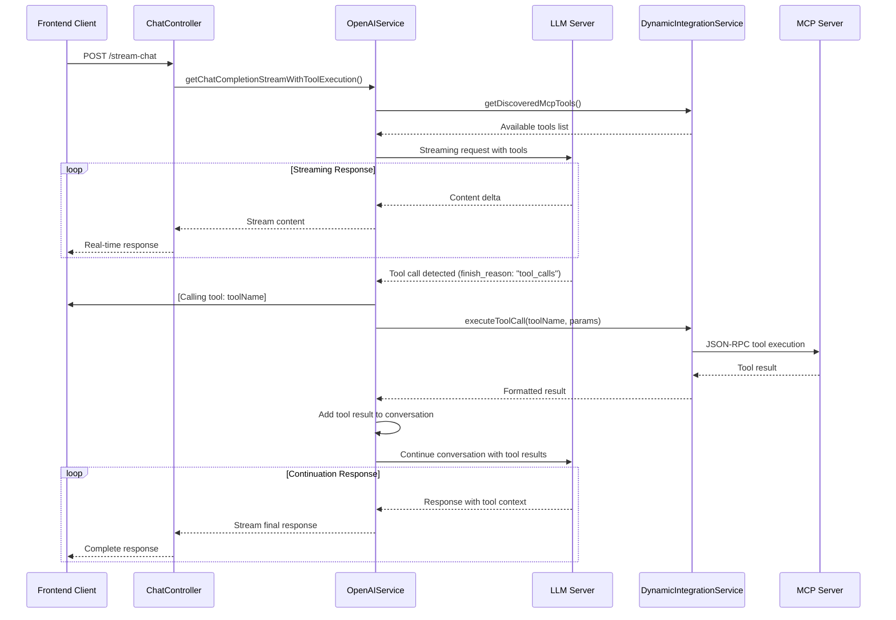

# MCP Tool Execution Workflow

## Overview

This document describes the complete Model Context Protocol (MCP) tool execution workflow implemented in version 1.2.0. The system provides full integration between LLM streaming responses and external MCP server tool execution.

## Tool Execution Architecture

### Core Components

1. **OpenAIService** - Enhanced with tool-aware streaming
2. **DynamicIntegrationService** - Tool discovery and execution
3. **ChatController/TaskController** - User-facing streaming endpoints

### Workflow Sequence



## Key Features

### Real-time Tool Feedback
- Users see tool execution progress: `[Calling tool: webcrawl]`
- Tool completion notifications: `[Tool completed successfully]`
- Error handling: `[Tool execution failed: reason]`

### Tool Discovery Integration
- Automatic inclusion of MCP tools in LLM requests
- Format conversion from MCP to OpenAI API format
- Server source tracking for tool attribution

### Reactive Streaming Architecture
- Non-blocking tool execution workflows
- Flux-based streaming with proper completion management
- Thread-safe concurrent execution prevention

### Error Resilience
- Graceful handling of tool execution failures
- Fallback responses for streaming failures
- Comprehensive logging for debugging

## Implementation Details

### OpenAIService Enhancements

#### New Methods
- `getChatCompletionStreamWithToolExecution()` - Main tool-enabled streaming
- `executeStreamingConversationWithTools()` - Core workflow handler
- `convertMcpToolsToOpenAIFormat()` - Tool format conversion
- `executeToolCallFromNode()` - Individual tool execution
- `continueConversationAfterTools()` - Conversation continuation

#### Tool Call Detection
```java
// Detects tool calls in streaming delta
JsonNode toolCallsNode = deltaNode.path("tool_calls");
if (toolCallsNode.isArray() && !toolCallsNode.isEmpty()) {
    // Process tool call and execute via MCP
}
```

### DynamicIntegrationService Tool Execution

#### New Methods
- `executeToolCall()` - Execute tools via MCP servers
- `findServerForTool()` - Locate tool provider server
- `findServerConfigByName()` - Server configuration lookup

#### Tool Execution Flow
1. **Tool Discovery**: Find which MCP server provides the requested tool
2. **Session Management**: Ensure valid MCP session exists
3. **JSON-RPC Call**: Execute tool with proper parameters
4. **Result Processing**: Format and return execution results

### Controller Updates

Both `ChatController` and `TaskController` now use the enhanced streaming:

```java
// Updated streaming endpoint
return openAIService.getChatCompletionStreamWithToolExecution(conversationHistory, modelToUse)
    .doOnError(e -> logger.error("Error during AI stream: {}", e.getMessage()))
    .onErrorResume(e -> Flux.just("{\"error\": \"Error: " + e.getMessage() + "\"}"));
```

## Configuration

### MCP Server Setup
```properties
# External MCP Servers
agent.integrations.mcp-servers[0].name=webcrawl-mcp
agent.integrations.mcp-servers[0].url=http://localhost:3001
```

### Tool Format Example
```json
{
  "type": "function",
  "function": {
    "name": "webcrawl",
    "description": "Crawl web pages for content",
    "parameters": {
      "type": "object",
      "properties": {
        "url": {
          "type": "string",
          "description": "URL to crawl"
        }
      }
    }
  }
}
```

## Testing

### Test Coverage
- **OpenAIServiceMcpToolsTest** - Comprehensive tool integration tests
- Tool workflow testing with mock MCP servers
- WebClient interaction testing
- Error scenario validation

### Mock Tool Execution
```java
@Test
public void testToolExecutionWorkflow() {
    // Setup mock tools and conversation
    List<ChatMessage> messages = createSampleConversation();
    when(dynamicIntegrationService.getDiscoveredMcpTools()).thenReturn(mcpTools);
    
    // Test tool execution streaming
    var flux = openAIService.getChatCompletionStreamWithToolExecution(messages);
    assertNotNull(flux);
}
```

## Best Practices

### Tool Development
1. **Proper Error Handling**: Always return structured error responses
2. **Parameter Validation**: Validate all tool parameters before execution
3. **Result Formatting**: Return JSON-serializable results
4. **Performance**: Keep tool execution under 30 seconds

### Frontend Integration
1. **Stream Processing**: Handle streaming tool feedback in UI
2. **Error Display**: Show tool errors to users appropriately
3. **Progress Indicators**: Use tool execution messages for UX
4. **Fallback Handling**: Graceful degradation when tools fail

## Troubleshooting

### Common Issues

1. **Tool Not Found**: Check MCP server configuration and tool discovery
2. **Session Errors**: Verify MCP server initialization
3. **Streaming Interruption**: Check WebClient configuration and timeouts
4. **Tool Execution Timeout**: Review MCP server performance

### Debug Logging
```properties
logging.level.com.steffenhebestreit.ai_research.Service.OpenAIService=DEBUG
logging.level.com.steffenhebestreit.ai_research.Service.DynamicIntegrationService=DEBUG
```

## Future Enhancements

- **Parallel Tool Execution**: Execute multiple tools concurrently
- **Tool Result Caching**: Cache frequently used tool results
- **Custom Tool Timeout**: Configurable timeout per tool type
- **Tool Usage Analytics**: Track tool usage and performance metrics
