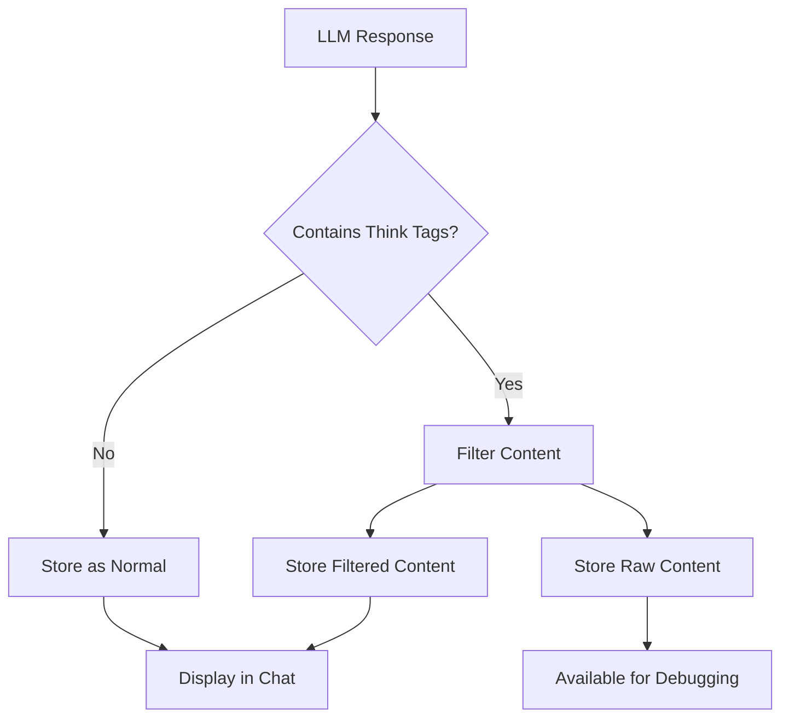

# Raw Content Storage Implementation

## Overview

The AI Research Project implements a dual-storage system for AI responses that preserves both filtered content for display and unfiltered LLM output for transparency and debugging purposes. This feature ensures complete transparency in AI interactions while maintaining security and proper content filtering.

## Architecture

### Dual Storage System

The system stores two versions of each AI response:

1. **Filtered Content** (`content` field): Clean version displayed in the chat interface
2. **Raw Content** (`rawContent` field): Complete unfiltered LLM output including think tags

### Database Schema Changes

**ChatMessage Entity Updates:**
```java
@Column(name = "raw_content", length = 30000)
private String rawContent; // Store unfiltered LLM output with think tags
```

- Added `rawContent` field with 30,000 character limit
- Maintains backward compatibility with existing `content` field
- Automatic storage when content filtering occurs

## Implementation Details

### Core Components

#### 1. ChatMessage Entity
- **Location**: `src/main/java/com/steffenhebestreit/ai_research/Model/ChatMessage.java`
- **Changes**: Added `rawContent` field with getter/setter methods
- **Purpose**: Store both filtered and unfiltered content versions

#### 2. ChatService Updates
- **Location**: `src/main/java/com/steffenhebestreit/ai_research/Service/ChatService.java`
- **New Method**: `updateMessageRawContent(String messageId, String rawContent)`
- **Purpose**: Update raw content for existing messages with transaction safety

#### 3. ChatController Integration
- **Location**: `src/main/java/com/steffenhebestreit/ai_research/Controller/ChatController.java`
- **Changes**: 
  - Automatic raw content saving in `createChat()`, `addMessageToChat()`, and `streamMessage()`
  - New endpoint `GET /{chatId}/messages/{messageId}/raw` for raw content retrieval
- **Purpose**: Seamless raw content storage during normal chat operations

### Content Filtering Flow



1. **Original Response**: LLM generates response with think tags
2. **Content Filtering**: `ContentFilterUtil.filterForDatabase()` removes think tags
3. **Dual Storage**: Both versions stored if filtering occurred
4. **Display**: Only filtered content shown in chat interface
5. **Access**: Raw content available via dedicated API endpoint

### Security Implementation

#### LLM Communication Protection

**Critical Security Measure**: The `prepareMessagesForLlm()` method in `OpenAIService` uses only filtered content:

```java
// SECURITY: Only filtered content is sent to LLM providers
String content = (String) msg.getContent(); // Uses filtered content field
```

This ensures:
- Think tags are never transmitted to external LLM services
- Raw content remains internal to the application
- External API calls receive only clean, filtered content

#### Content Isolation

- **Internal Storage**: Raw content stored securely in database
- **API Access**: Raw content only accessible through dedicated endpoints
- **External Communication**: Only filtered content used in LLM API calls

## API Endpoints

### Raw Content Retrieval

**Endpoint**: `GET /research-agent/api/chats/{chatId}/messages/{messageId}/raw`

**Purpose**: Retrieve the unfiltered LLM output for debugging and transparency

**Parameters**:
- `chatId`: Chat identifier
- `messageId`: Specific message identifier

**Response Format**:
```json
{
  "result": {
    "messageId": "msg-uuid-123",
    "rawContent": "<think>Internal reasoning here...</think>Visible response content",
    "filteredContent": "Visible response content",
    "hasRawContent": true
  }
}
```

**Response Fields**:
- `messageId`: Message identifier
- `rawContent`: Original unfiltered LLM output (may include think tags)
- `filteredContent`: Content displayed in chat interface
- `hasRawContent`: Boolean indicating if raw content is available

### Automatic Storage Integration

Raw content is automatically stored during these operations:
- `POST /chats/create` - When creating new chats with filtered content
- `POST /chats/{chatId}/messages` - When adding messages with think tags
- `POST /chats/{chatId}/message/stream` - When streaming responses contain think tags

## Use Cases

### 1. Debugging AI Responses

**Scenario**: AI response seems incomplete or unexpected

**Solution**: Access raw content to see complete LLM reasoning:
```bash
GET /chats/chat-123/messages/msg-456/raw
```

**Benefit**: Understand full context including internal reasoning and tool execution details

### 2. System Prompt Optimization

**Scenario**: Need to improve AI response quality

**Solution**: Analyze think tags to understand reasoning patterns

**Benefit**: Optimize system prompts based on actual AI reasoning processes

### 3. Transparency and Auditing

**Scenario**: Need to verify AI decision-making process

**Solution**: Review raw content for complete transparency

**Benefit**: Full visibility into AI reasoning for compliance and trust

### 4. Development and Testing

**Scenario**: Developing new features or troubleshooting issues

**Solution**: Compare filtered vs raw content to verify filtering logic

**Benefit**: Ensure proper content handling and filtering functionality

## Testing

### Automated Testing

**Test Component**: `RawContentTest.java`
- **Location**: `src/main/java/com/steffenhebestreit/ai_research/Test/RawContentTest.java`
- **Purpose**: Verify raw content storage functionality
- **Test Flow**:
  1. Create message with think tags
  2. Filter content using `ContentFilterUtil`
  3. Store both versions
  4. Verify raw content preservation

### Manual Testing

**Test Files Provided**:
- `test_message.json`: Message with think tags for testing
- `simple_test.json`: Simple message without think tags

**Test Procedure**:
1. Send message with think tags via API
2. Verify filtered content in chat display
3. Access raw content via debug endpoint
4. Confirm both versions stored correctly

### Verification Commands

```bash
# Test chat creation with think tags
curl -X POST http://localhost:8080/research-agent/api/chats/create \
  -H "Content-Type: application/json" \
  -d @test_message.json

# Retrieve raw content for verification
curl http://localhost:8080/research-agent/api/chats/{chatId}/messages/{messageId}/raw
```

## Configuration

### Database Configuration

**Required**: Ensure database schema supports the new `raw_content` column:
- Column: `raw_content`
- Type: `VARCHAR(30000)` or equivalent
- Nullable: `YES`

**Migration**: Automatic via Hibernate DDL with `spring.jpa.hibernate.ddl-auto=update`

### Content Filtering Configuration

**Filter Utility**: `ContentFilterUtil.filterForDatabase()`
- Removes `<think>...</think>` tags
- Preserves all other content
- Ensures database size constraints

## Best Practices

### Security

1. **Never expose raw content in public APIs** without proper authentication
2. **Always use filtered content** for external LLM communication
3. **Implement proper access controls** for raw content endpoints
4. **Log access to raw content** for security auditing

### Performance

1. **Store raw content selectively** - only when filtering occurs
2. **Use appropriate database indices** for efficient raw content queries
3. **Consider content compression** for very large responses
4. **Implement cleanup policies** for old raw content data

### Development

1. **Test both storage paths** - with and without think tags
2. **Verify filtering logic** regularly to ensure proper content separation
3. **Monitor raw content sizes** to prevent database bloat
4. **Document any changes** to filtering logic or storage mechanisms

## Troubleshooting

### Common Issues

#### Raw Content Not Stored
**Symptom**: `hasRawContent` returns `false` when expected
**Cause**: Content filtering did not occur (no think tags present)
**Solution**: Verify input contains think tags or filtering logic

#### Security Concerns
**Symptom**: Think tags appearing in LLM API calls
**Cause**: Using raw content instead of filtered content
**Solution**: Verify `prepareMessagesForLlm()` uses `msg.getContent()`

#### Performance Issues
**Symptom**: Slow database operations with large raw content
**Cause**: Large unfiltered responses causing storage overhead
**Solution**: Implement content size limits or compression

### Logging and Debugging

**Enable Debug Logging**:
```properties
logging.level.com.steffenhebestreit.ai_research.Controller.ChatController=DEBUG
logging.level.com.steffenhebestreit.ai_research.Service.ChatService=DEBUG
```

**Key Log Messages**:
- "Saved raw content for message {messageId}" - Successful raw content storage
- "Filtered message content, original length: {}, filtered length: {}" - Content filtering occurred
- "Raw content properly saved: {}" - Test verification message

## Future Enhancements

### Potential Improvements

1. **Content Compression**: Implement compression for large raw content
2. **Retention Policies**: Automatic cleanup of old raw content data
3. **Analysis Tools**: Built-in tools for analyzing think tag patterns
4. **Export Functions**: Export raw content for external analysis
5. **Batch Operations**: Bulk operations for raw content management

### API Enhancements

1. **Bulk Raw Content Retrieval**: Get raw content for multiple messages
2. **Raw Content Search**: Search within raw content for specific patterns
3. **Statistical Analysis**: APIs for analyzing think tag usage patterns
4. **Content Comparison**: Compare filtered vs raw content differences

## Conclusion

The Raw Content Storage implementation provides a robust foundation for transparency, debugging, and system improvement while maintaining security and proper content filtering. This feature enables full visibility into AI reasoning processes without compromising the user experience or system security.

The dual-storage approach ensures that both user-facing content and complete AI outputs are preserved, supporting both immediate usability and long-term system analysis and improvement goals.
